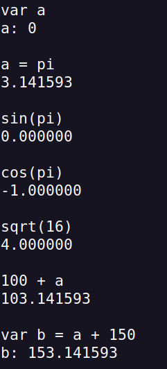

# flex-bison-calculator

This is a project for the Syntax and Semantics of Languages course in UTN FRBA.
The project consists of a calculator made using flex, bison and C with the language design techniques learnt in class.

The language specification is available in BNF.pdf.

## Usage

With this calculator you can make common operations like:

- Sum: a + b
- Substraction: a - b
- Multiplication: a * b
- Division: a / b

You have access to common functions like:

- sin, cos, tan
- asin, acos, atan
- sqrt, log (base 10)

And constants:

- e
- pi

You can also declare variables, assign them values and use them like this:

var a
var b = 10
a = 10 + b

## How to run the calculator:

1. Make sure to have Flex and Bison installed.
2. Run `make`.
3. Run `./calc` to run it as an interactive shell. You can also pass files to it by changing the stdin, and receive the results in a new file by changing stout. For example: ./calc < script.txt > output.txt

## Example:

.
